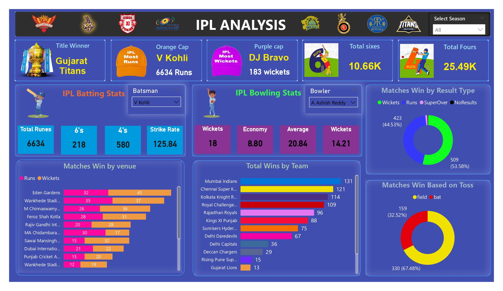
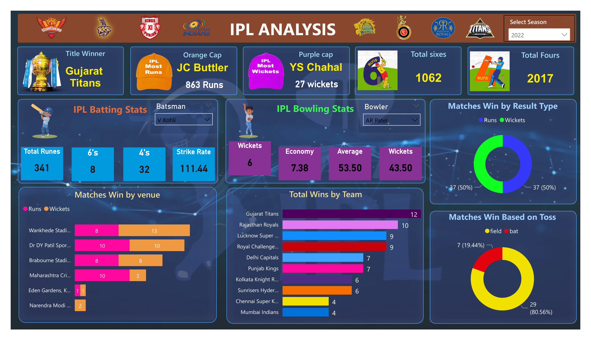

# 🏏 IPL Power BI Dashboard Analysis

This repository contains visual analytics dashboards of the **Indian Premier League (IPL)** created using **Microsoft Power BI**. The dashboards offer rich insights into various aspects of IPL seasons including player performances, team wins, match outcomes, and more.

---

## 📊 Dashboard Overview

These Power BI dashboards offer a season-wise breakdown of IPL data, presented in a vibrant and interactive format. Each visual is designed to help cricket analysts, fans, and developers understand player statistics and team performance with clarity.

### 🖼️ Dashboards Included

1. **IPL Full Season Overview** (Image: `IPL_bi_page-0001.jpg`)
   - Title Winner, Orange Cap, Purple Cap
   - Batting & Bowling stats (Total Runs, Strike Rate, Economy, Average)
   - Total Sixes & Fours
   - Match Wins by Venue
   - Total Wins by Team
   - Wins by Toss and Result Type

2. **IPL 2022 Season Analysis** (Image: `IPL_bi-1.png`)
   - Focused view of the 2022 season
   - Key player stats (JC Buttler, YS Chahal, V Kohli, AR Patel)
   - Team-wise wins and venue-wise match results

---

## 📁 Files Included


---

## 🔍 Features

- 📌 Interactive Data Slicers (Season selection)
- 📈 Detailed Batting & Bowling Stats
- 🏆 Team and Player Highlights
- 🎯 Match Wins by Result & Toss Analysis
- 📍 Venue-based Performance Insights

---

## 💡 How to Use

You can use the visuals or dashboards for:

- 🧑‍🏫 Presentations and Reports
- 🧪 Data Science or Analytics Projects
- 🌐 Embedding in Websites or Blogs
- 🏟️ IPL Research or Sports Journalism

Example HTML embed:
```html


